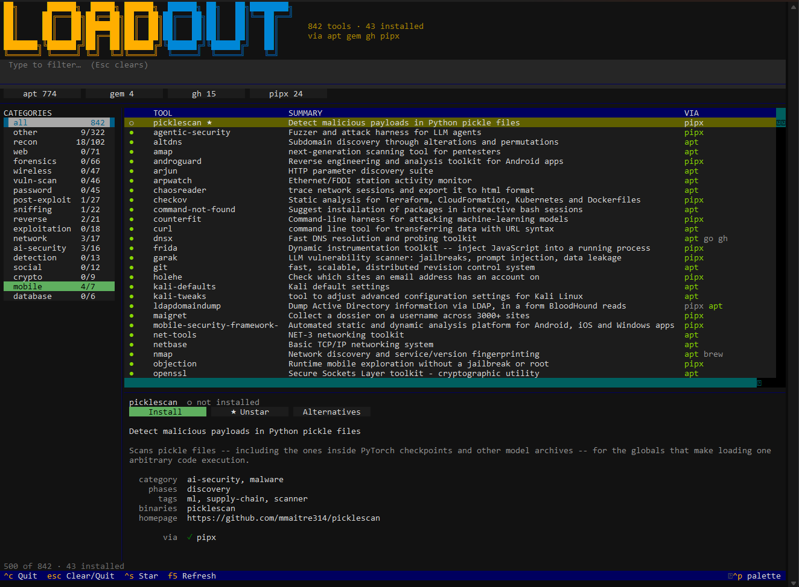

<h1 align="center">Loadout</h1>

<p align="center">
  <b>Pick your kit, install it anywhere, prove what you used.</b><br>
  A security tool manager that isn't tied to one distro or one package manager.
</p>

<p align="center">
  <a href="https://github.com/MushroomCyber/Loadout/actions/workflows/ci.yml"></a>
  
  
  
</p>

<p align="center">
  
</p>

---

The tools worth having no longer ship from one place. `nuclei`, `subfinder` and
`httpx` come from the Go toolchain; `impacket` and `prowler` from pipx;
`hayabusa` and `velociraptor` from GitHub releases; plenty more from apt or
Homebrew. Loadout describes each tool **once** and installs it with whichever
backend your machine actually has.

```bash
loadout install nuclei          # apt on Kali, brew on macOS, go anywhere else
loadout bundle create -l dfir-responder -o kit.tar   # then install it with no network
loadout sync                    # converge this box to the team's loadout.yaml
loadout report --since 30d      # signed inventory of what you used, for the report
```

---

## Why this instead of `apt install`

|  | `apt` | Loadout |
|---|---|---|
| Works on Kali, Ubuntu, Arch, macOS, WSL | partly | yes |
| Installs Go / Rust / pipx / release-binary tools | no | yes |
| Verifies downloaded binaries against published checksums | n/a | yes, by default |
| "Which tools exist for lateral movement?" | no | `loadout phase lateral-movement` |
| "What should I use instead of dirbuster?" | no | `loadout alt dirbuster` |
| Install onto a machine with no internet | no | `loadout bundle` |
| Reproduce this exact toolset on another box | no | `loadout sync` |
| Prove which tool versions an engagement used | no | `loadout report` |

---

## Install

From a local checkout of this repository:

```bash
git clone https://github.com/MushroomCyber/Loadout.git
cd Loadout
python3 -m venv .venv
source .venv/bin/activate
pip install -e '.[dev,tui]'
```

If you want a pipx-managed environment for the local repo checkout instead of a
plain virtualenv:

```bash
pipx install --editable .
```

Then launch the interactive browser:

```bash
loadout
```

Check the machine is ready:

```bash
loadout doctor
```

> `pipx install loadout` is for a published package on PyPI; this repo is a local
> source checkout and is installed from the checkout with `pip install -e .` or
> `pipx install --editable .`.

### Kali / Linux quick start

On Kali, Debian, Ubuntu, or most Linux hosts:

```bash
git clone https://github.com/MushroomCyber/Loadout.git
cd Loadout
python3 -m venv .venv
source .venv/bin/activate
pip install -e '.[dev,tui]'
loadout
```

The first launch opens the interactive browser. Type to filter, arrow keys to
move, `enter` to act on the highlighted tool. Everything is also clickable --
see [Interactive browser](#interactive-browser).

### Upgrading Loadout

Two different things get upgraded, and they are separate commands on purpose:
**Loadout itself** comes from this repository, and **the tools it installed for
you** come from their own package managers.

To upgrade Loadout:

```bash
cd Loadout
git pull
source .venv/bin/activate
pip install -e '.[dev,tui]'   # picks up dependency changes
loadout --version
loadout catalog info          # confirm the new catalog is the one in use
```

With a pipx-managed checkout, `pipx install --editable . --force` instead of the
`pip install` line.

`git pull` brings a rebuilt catalog with it, so there is nothing to compile.
Run `loadout catalog build` only if you edited `catalog/` yourself.

Your data is untouched by an upgrade: loadouts, history, stars and provenance
live in `$XDG_STATE_HOME` and `$XDG_CONFIG_HOME`, never inside the package.

> **If `loadout catalog info` still shows the old tool count**, you have a
> refreshed catalog in `$XDG_DATA_HOME/loadout/catalog.db` from a previous
> `loadout catalog update`, and it deliberately wins over the one shipped with
> the release — otherwise an upgrade would throw away a refresh. Re-run
> `loadout catalog update` to rebuild it from this machine's package metadata,
> or delete that file to fall back to the catalog you just pulled.

To upgrade the tools themselves:

```bash
loadout update                # refresh package lists, report what is upgradable
loadout upgrade --dry-run     # show exactly what would change
loadout upgrade               # apply it
loadout hold burpsuite        # pin a version an engagement depends on
```

If an upgrade leaves the machine in an odd state, `loadout doctor` names the
problem rather than making you guess.

---

## Everyday use

### Find things

```bash
loadout                          # interactive browser, filter as you type
loadout search fuzz              # full-text search across names and summaries
loadout show ffuf                # everything known, including how to install it here
loadout list --category web      # browse a category
loadout phase lateral-movement   # browse by engagement phase
loadout alt dirbuster            # what people use instead
loadout providers                # which installers work on this machine
```

### Install things

```bash
loadout install ffuf nuclei subfinder
loadout install nuclei --dry-run          # show the plan, change nothing
loadout install nuclei --provider go      # force a backend
loadout install nuclei --prefer brew      # nudge the resolver
loadout remove nikto --yes
loadout run gowitness scan file -f hosts  # run it, in a container if not installed
```

Loadout picks a provider per tool, per machine. `--dry-run` prints exactly what
would run before anything happens:

```
Plan (install):
  nuclei via go
      $ go install github.com/projectdiscovery/nuclei/v3/cmd/nuclei@latest
  ffuf via apt
      $ apt-get install -y -o Dpkg::Options::=--force-confold -- ffuf
```

### Loadouts

A loadout is the kit for a job. Bundled ones cover common roles; you can write
your own or capture what you already have.

```bash
loadout loadout list
loadout loadout show ad-operator
loadout loadout apply dfir-responder
loadout loadout save my-kit               # snapshot this machine
```

Commit a `loadout.yaml` to the engagement repo and everyone gets the same box:

```yaml
slug: acme-webapp-2026
name: ACME web app test
tools: [ffuf, nuclei, sqlmap, burpsuite, httpx, katana]
```

```bash
loadout sync                    # install what's missing
loadout sync --prune            # and remove what isn't declared
loadout loadout diff acme-webapp-2026
```

| Loadout | For |
|---|---|
| `pentester-web` | Web application testing |
| `recon-modern` | The Go-toolchain recon pipeline, no apt needed |
| `ad-operator` | Active Directory assessment and lateral movement |
| `bug-bounty` | Public programme recon and web |
| `dfir-responder` | Host and log forensics |
| `detection-engineer` | Building and validating detections |
| `cloud-auditor` | Cloud and container posture |
| `ai-redteam` | LLM applications, agents, and model-file scanning |
| `forensics-starter`, `osint-minimal`, `ctf-basics` | Starter kits |

### Take a kit somewhere with no network

Incident response happens on isolated segments. Client sites block egress.
Classified work has no route out at all. Build the kit where there *is*
network, carry it in, install it where there is none.

```bash
# on a connected machine
loadout bundle create -l dfir-responder -o kit.tar
loadout bundle inspect kit.tar          # what is in it, and what was left out

# on the isolated one
loadout bundle verify kit.tar           # intact? built for this architecture?
loadout bundle install kit.tar
```

A bundle is a tar holding a `manifest.json` and the artifacts themselves — apt
packages **with their full dependency closure**, and verified GitHub release
binaries. Nothing about installing it touches the network.

The bundle is the one thing here that arrives from outside, onto a machine
picked precisely because it is isolated, so it is treated as untrusted input:

- every file is checksummed into the manifest when built and **re-checksummed
  before use** — otherwise a bundle would be a clean way around all the
  checksum and signature verification everywhere else;
- member paths are validated before extraction, so no `..`, absolute path,
  symlink or device node can write outside the target;
- the build platform is recorded, because a bundle of amd64 debs is not a kit
  on an arm64 box and mid-engagement is the wrong time to find out.

**What cannot travel:** `go`, `cargo`, `pipx`, `npm` and `gem` routes need a
toolchain or a package index on the far side. Those are reported per tool with
a reason rather than quietly dropped — a bundle that held less than it claimed
would be discovered on the isolated machine, which is the worst place to
discover anything. Where a tool has both a bundleable and a non-bundleable
route, the bundleable one is chosen even if the catalog ranks it lower.

### Check the kit before you need it

An install that reported success is not the same as a tool that runs. A Go
binary can land off `PATH`, an apt package can install while its interpreter
does not, a release archive can hold the wrong architecture — all three report
"installed" and all three fail on site.

```bash
loadout verify                  # everything installed
loadout verify nmap ffuf        # just these
loadout verify --quiet          # only what is broken
```

```
✓ ffuf   ffuf version v2.1.0
✓ nmap   Nmap version 7.99 ( https://nmap.org )
✗ nuclei nuclei: not found on PATH
  2 verified · 1 failed
```

It exits non-zero if anything failed, so it works as the last line of a
pre-engagement script. Four outcomes are reported separately rather than
collapsed, because they are not equally strong claims: **verified** means the
catalog's `verify:` command ran and exited 0; **on PATH** means the binary was
found but never run; **failed** means it did not work; **not checkable** means
the catalog records neither a command nor a binary name.

### Prove what you used

Pentest reports and DFIR chain-of-custody both need "which tools, which
versions, when". Loadout records that as it works, so the report is evidence
rather than recollection.

```bash
loadout report --since 30d --format markdown -o tooling.md
loadout audit                   # unmaintained, superseded or unverified tooling
loadout history --tool nuclei
```

### Take it elsewhere

```bash
loadout export --format script   > install.sh
loadout export --format docker   > Dockerfile
loadout export --format ansible  > playbook.yml
loadout export --format loadout  > loadout.yaml
```

### Everything speaks JSON

```bash
loadout list --installed --json | jq -r '.[].id'
loadout install nuclei --dry-run --json | jq '.actions[].steps'
loadout doctor --json | jq '.[] | select(.severity != "ok")'
loadout verify --json | jq -r '.[] | select(.status == "failed") | .tool'
```

---

## Interactive browser

`loadout` with no arguments. The cursor starts in the filter box and the list
narrows as you type.

The screenshot at the top of this page is exactly what you get. The banner
drops to a single line on terminals under 96x30, so a small window spends its
rows on tools rather than on the program's own name.

### Keys

| Key | Action |
|---|---|
| *type* | Filter immediately |
| `↑` `↓` | Move |
| `space` | Mark a tool |
| `enter` | Install / remove the highlighted tool |
| `ctrl+a` | Install everything marked |
| `ctrl+s` | Star |
| `ctrl+p` | Command palette — fuzzy-find and apply a loadout |
| `f5` | Re-read what is installed |
| `esc` | Clear filter, then clear marks, then quit |

### Mouse

Every control calls the same action its key binding does, so nothing behaves
differently depending on how you reached it.

| Control | Where | Does |
|---|---|---|
| **Install** / **Remove** | Detail pane | Acts on the selected tool; the label tracks its state |
| **★ Star** | Detail pane | Toggles the star |
| **Run** | Detail pane | Only shown when the tool has a known binary or a container image |
| **Alternatives** | Detail pane | Only shown when the catalog lists any |
| **Install *n* marked** / **Clear** | Batch bar | Appears once something is marked, and counts it |
| Provider toggles | Under the filter box | Narrow the list to one or more backends |
| Category chips | Left sidebar | Filter by category |
| **Retry** / **Close** | Install modal | A failed install offers a next step, not just red text |

Two of those carry state you can read at a glance:

- **Provider toggles** are only offered for backends that are both usable on
  this machine *and* present in the catalog, and are labelled with how many
  entries they cover: `apt 768`, `gh 15`, `pipx 10`. An active toggle takes the
  accent colour.
- **Category chips** show installed-over-total (`wireless 14/48`), and turn
  green once you have a third of a category. The active chip takes the accent.

---

## The catalog

The catalog is **data, not code**: one YAML file per tool under
[`catalog/`](catalog/), reviewed by pull request and compiled into a SQLite
database with a full-text index.

```yaml
# catalog/web/ffuf.yaml
id: ffuf
summary: Fast web fuzzer for content and parameter discovery
categories: [web, fuzzing]
tags: [fuzzing, bug-bounty]
phases: [discovery]
binaries: [ffuf]
homepage: https://github.com/ffuf/ffuf
license: Apache-2.0
verify: ffuf -V
alternatives: [feroxbuster, gobuster, dirsearch]
install:
  - {provider: apt,    package: ffuf, distros: [kali, debian, parrot, ubuntu]}
  - {provider: brew,   formula: ffuf}
  - {provider: go,     module: github.com/ffuf/ffuf/v2@latest}
  - {provider: github, repo: ffuf/ffuf, checksums: "*checksums*.txt"}
```

```bash
loadout catalog validate        # check the source tree
loadout catalog build           # compile it
loadout catalog update          # enrich from local APT metadata
loadout catalog info
```

Adding a tool is one file and a pull request. See
[docs/CATALOG.md](docs/CATALOG.md).

**Providers implemented:** `apt` · `brew` · `pipx` · `go` · `cargo` · `gem` ·
`npm` · `github` (verified release downloads) · `docker`

**Providers with catalog coverage today:** `apt` 768 · `brew` 33 · `github` 15 ·
`go` 10 · `pipx` 10 · `gem` 2 · `cargo` 1. `npm` and `docker` work but no entry
uses them yet — adding one is a pull request, not a code change.

---

## Configuration

| Path | Holds |
|---|---|
| `$XDG_CONFIG_HOME/loadout/loadouts/*.yaml` | Your loadouts |
| `$XDG_STATE_HOME/loadout/state.db` | Installs, history, stars, provenance |
| `$XDG_DATA_HOME/loadout/catalog.db` | The compiled catalog |
| `./loadout.yaml` | Project manifest for `loadout sync` |

| Variable | Effect |
|---|---|
| `LOADOUT_OFFLINE=1` | Make no network calls |
| `LOADOUT_NO_EMOJI=1` | ASCII glyphs (auto-detected too) |
| `LOADOUT_THEME` | `default`, `mono`, `solarized-dark`, `high-contrast` |
| `LOADOUT_BIN_DIR` | Where release binaries land (default `~/.local/bin`) |
| `GITHUB_TOKEN` | Raises the GitHub API rate limit |
| `NO_COLOR` / `FORCE_COLOR` | Respected |

---

## Security

Loadout runs `sudo` and downloads binaries, so it holds itself to the bar that
implies:

- `sudo` is constructed in exactly one function, `policy.elevate()` — enforced by a test.
- Every package name is validated before it reaches an argv, and `--` always separates options from names.
- Downloaded artifacts are checksummed against the release's own checksum file. **No checksum means refusal**, not a warning; `--allow-unverified` is an explicit opt-in.
- Where upstream signs its releases, the catalog pins the key and the signature is checked with `gpg`, `minisign` or `cosign`. The signing key must be the pinned one — a valid signature by some *other* key is a failure, which is the check a bare `gpg --verify` exit code does not make. Verification runs against a throwaway keyring, so a catalog entry can never read or write your own. **A declared signature cannot be waived by `--allow-unverified`**; that flag is for projects that publish nothing to check against, not for checks that fail.
- Archive extraction refuses absolute paths and `..` traversal.
- No `shell=True` anywhere.
- **Your sudo password never passes through loadout.** The browser hands the
  terminal back so `sudo` can read it from `/dev/tty` itself, which is why
  there is no password box in the app — a nicer-looking one would mean the
  password transiting this process. A test fails if the credential path ever
  grows an `input()`, a stdin pipe or a `getpass` call.

See [SECURITY.md](SECURITY.md) for the threat model and how to report an issue.

---

## Contributing

Adding a tool to the catalog is the easiest useful contribution — one YAML file,
no Python. See [docs/CATALOG.md](docs/CATALOG.md) for the format and
[CONTRIBUTING.md](CONTRIBUTING.md) for the workflow. There is an
[issue template](https://github.com/MushroomCyber/Loadout/issues/new?template=add-tool.yml)
if you would rather suggest a tool than write the entry yourself..

```bash
pip install -e '.[dev,tui]'
pytest
ruff check .
mypy loadout
```

Open [issues](https://github.com/MushroomCyber/Loadout/issues) are the place to
look for something to pick up, and the place to propose something that is not
there yet.

---

## License

MIT. See [LICENSE](LICENSE).
